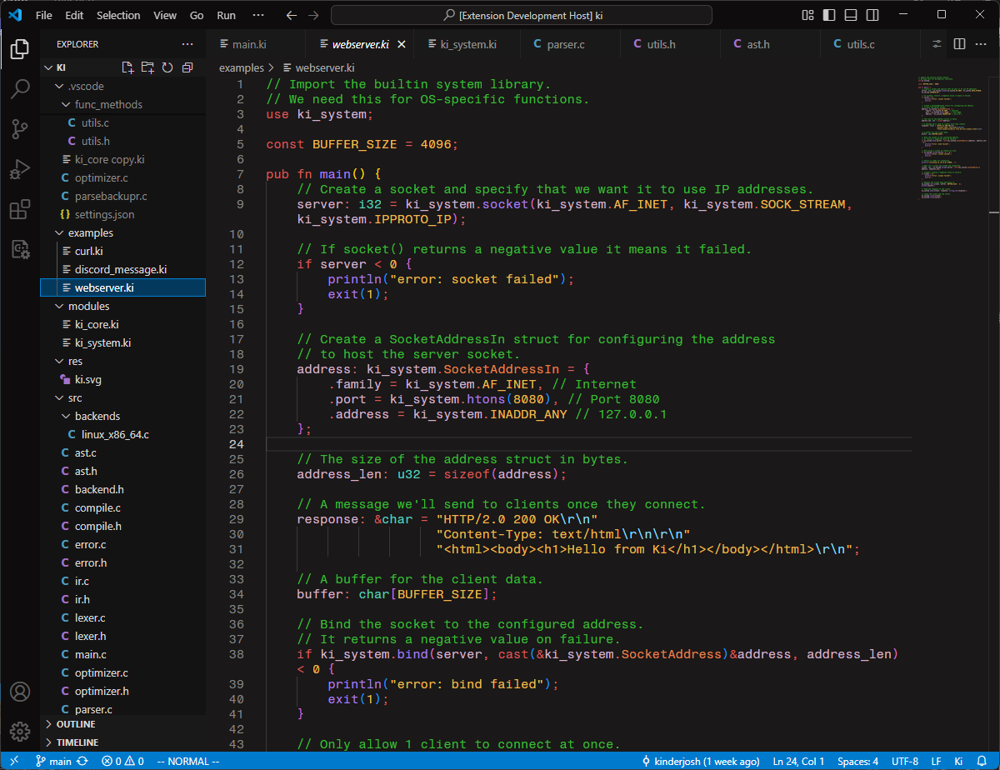

# Ki Language Support for VScode

This extension provides syntax highlighting for the [Ki programming language](https://github.com/kinderjosh/ki).

The color theme seen below is the [Kai color theme](https://github.com/kinderjosh/kai-color-theme).

